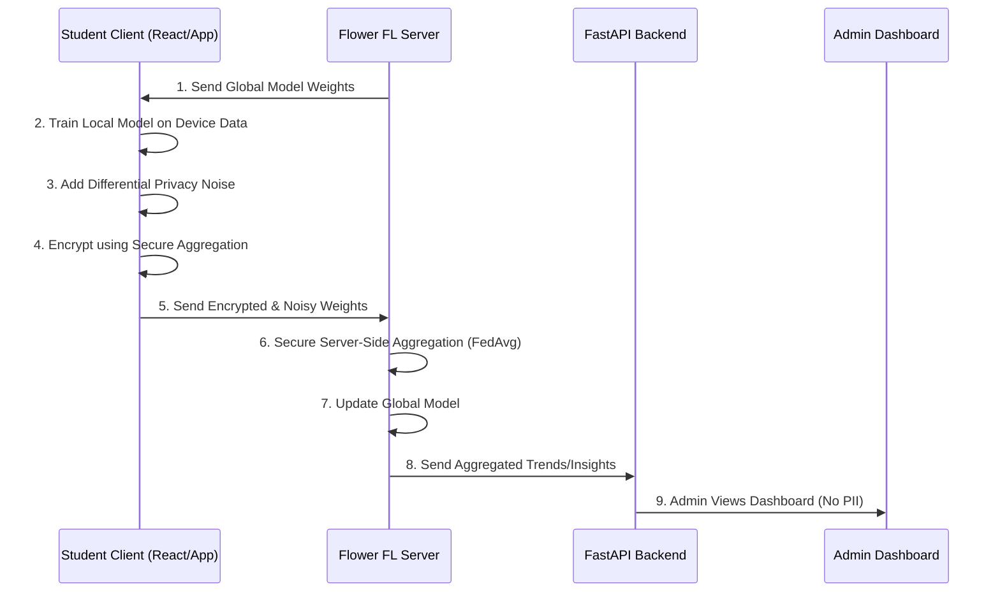

# EduShield AI - Architecture Design

## 1. High-Level Architecture
EduShield AI implements a **Federated Learning (FL) Smart Campus System** where predictive AI models are trained on student devices, and only securely aggregated insights are sent to the central campus server.

The 3-Tier Architecture is as follows:
1. **Frontend (Student & Admin Dashboard)**: Developed in React. Connects to backend endpoints and handles user roles (Student vs Admin).
2. **Backend Server (FastAPI)**: REST API serving responses to the dashboards. Role-based middleware ensures Admins cannot access individual local datasets and instead view statistical distribution.
3. **Federated Server (Flower - Python)**: Coordinates the global model training over multiple local student clients using Secure Aggregation.

## 2. Federated Training Cycle Diagram

## 3. Data Flow Diagram
- **Student Data**: Stays Local in the client app SQLite/Local DB. Includes marks, attendance, and local habits.
- **Model Updates**: Flow from Client -> FL Server.
- **Aggregated Analytics**: Flow from FL Server -> Backend -> Admin Dashboard. Admin only receives population-level statistics and trend analyses.

## 4. Role-based Access Architecture
- **Student Role**: Secured via JWT. Can see local recommendations, personal weakness graphs, and readiness scores. Does not send this data upstream.
- **Admin Role**: Secured via JWT. Cannot fetch `/student/{id}` metrics! Can only fetch `/aggregated-insights` endpoint which gathers data from the decentralized global model statistics.
